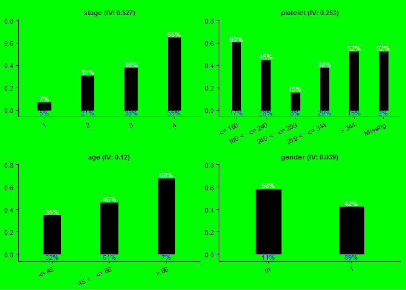
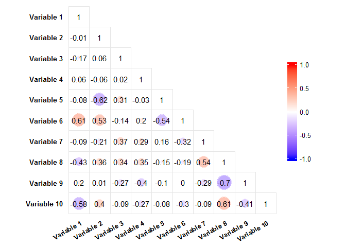
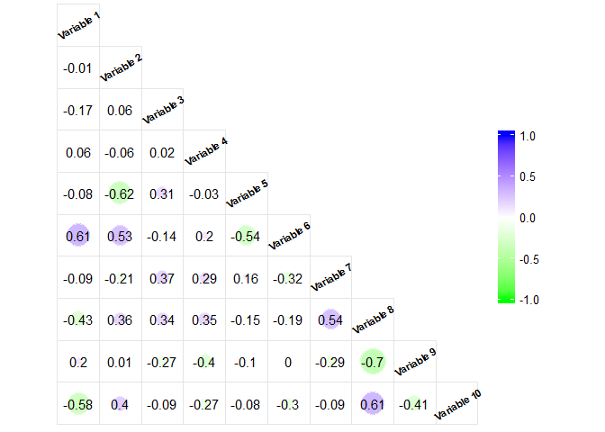
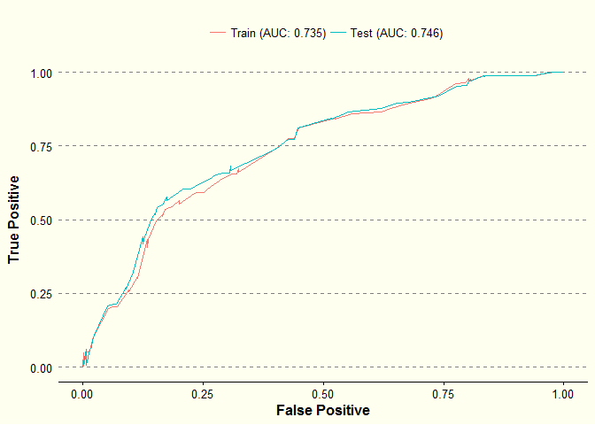
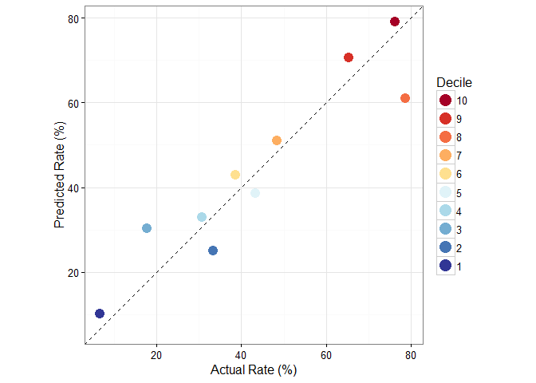
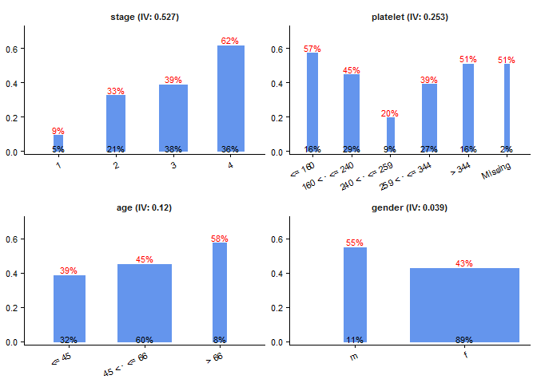

-   [流水化常规建模步骤：stremlineR包](#stremliner)
    -   [安装R包](#r)
    -   [数据准备(Survival PBC数据集)](#survival-pbc)
    -   [基于单变量回归的数据分箱: `bin.knn`](#-bin.knn)
    -   [基于决策树的数据分箱: `bin.rpart`](#-bin.rpart)
    -   [分组统计： `level.stat`](#-level.stat)
    -   [可视化分组统计结果: `ggstat`](#-ggstat)
    -   [利用WOE代替分类变量: `replace.woe`](#woe-replace.woe)
    -   [自变量间的相关性：`ggcorr`](#ggcorr)
    -   [建立逻辑(logistic)回归模型](#logistic)
    -   [测试集数据准备: `bin.custom & replace.woe`](#-bin.custom-replace.woe)
    -   [检测模型性能: `perf.auc & perf.decile`](#-perf.auc-perf.decile)
    -   [回归系数转换成原始0/1率: `coef2rate`](#01-coef2rate)
    -   [参考(reference)](#reference)

流水化常规建模步骤：stremlineR包
================================

**互动演讲版本请点[这里](https://jianhua.shinyapps.io/streamlineR_shinyapp/)**

这个`streamlineR`包的目的是把一些常规建模(尤其是逻辑回归跟生存模型）过程当中用得比较多的模块流水化。把纷繁的建模过程分解成一个个小步骤，每个步骤对应一到两个方程，从而使得整个建模过程更加清晰，效率更高。

安装R包
-------

下面我们用一个简单的例子来说明这个包的使用。除了`streamlineR`这个包裹外，这个分析依赖于其他R包。在分析前，我们得先把这些包都安装上。

### 安装依赖包

``` r
# 如果某些镜像被屏蔽了，可以用下面的方程选择其他镜像进行安装
# chooseCRANmirror()
install.packages(c('dplyr', 'car', 'caret', 'e1071', 'knitr', 'reshape2',
  'corrplot','rpart', 'scales', 'shiny', 'survival', 'gridExtra', 'devtools', 
  'pec', 'MASS', 'pROC', 'manipulate'), dependencies = TRUE)
```

### 加载依赖包

安装完后，我们需要加载这些包：

``` r
# Load pacakges
sapply(c('dplyr', 'car', 'caret', 'e1071', 'knitr', 'reshape2', 'corrplot','rpart', 
  'scales', 'survival', 'gridExtra', 'devtools', 'pec', 'MASS', 'pROC', 
  'manipulate'), 
  require, character.only = TRUE)
```

    ##      dplyr        car      caret      e1071      knitr   reshape2 
    ##       TRUE       TRUE       TRUE       TRUE       TRUE       TRUE 
    ##   corrplot      rpart     scales   survival  gridExtra   devtools 
    ##       TRUE       TRUE       TRUE       TRUE       TRUE       TRUE 
    ##        pec       MASS       pROC manipulate 
    ##       TRUE       TRUE       TRUE       TRUE

### 从GitHub上安装`streamlineR`

安装了`devtools`包后，我们可以用 `install_github` 方程来安装`streamlineR`包

``` r
# 如果install_github不能用，你可以用下面的链接下载这个包到本地再安装
# https://api.github.com/repos/JianhuaHuang/streamlineR/zipball/master 
devtools::install_github('JianhuaHuang/streamlineR')
library(streamlineR)
```

数据准备(Survival PBC数据集)
----------------------------

在这个例子中，我们会使用`survival`包中的一个肝硬化数据集(PBC)来阐述整个`streamlineR`包的使用过程。关于这个数据集的详细信息可以看[这里](https://stat.ethz.ch/R-manual/R-devel/library/survival/html/pbc.html)

### 加载数据

由于这个PBC数据集比较小，为了使后面的分析更加稳定，我们采用重复抽样的办法把数据量增加到10000条

``` r
dt <- survival::pbc %>%
  transmute(age = round(age), gender = sex, platelet, stage = as.character(stage), 
    time, status = as.numeric(status %in% c(1, 2))) %>%
  filter(!is.na(stage))

set.seed(1111)  # reproducible
dt <- dt[sample(nrow(dt), 10000, replace = T), ]
row.names(dt) <- NULL
dim(dt)
```

    ## [1] 10000     6

``` r
str(dt)
```

    ## 'data.frame':    10000 obs. of  6 variables:
    ##  $ age     : num  53 53 33 54 43 43 42 61 57 45 ...
    ##  $ gender  : Factor w/ 2 levels "m","f": 2 2 2 2 2 2 2 2 2 1 ...
    ##  $ platelet: int  344 361 418 216 275 214 102 233 231 NA ...
    ##  $ stage   : chr  "4" "3" "3" "3" ...
    ##  $ time    : int  2443 2574 1725 3282 1216 1067 1197 708 1978 4459 ...
    ##  $ status  : num  0 0 1 1 0 0 1 1 0 0 ...

``` r
head(dt)
```

    ##   age gender platelet stage time status
    ## 1  53      f      344     4 2443      0
    ## 2  53      f      361     3 2574      0
    ## 3  33      f      418     3 1725      1
    ## 4  54      f      216     3 3282      1
    ## 5  43      f      275     3 1216      0
    ## 6  43      f      214     3 1067      0

### 把数据分成训练数据跟测试数据

在做进一步分析前，整个数据集被分为两部分：训练数据跟测试数据。训练数据用于建模，而测试数据用于测试模型的可靠性。

``` r
set.seed(1111)
ind.train <- createDataPartition(dt$status, p = .7, list = FALSE)
dt.train <- dt[ind.train, ]
dt.test <- dt[-ind.train, ]
row.names(dt.train) <- NULL
row.names(dt.test) <- NULL
dim(dt.train)
```

    ## [1] 7000    6

``` r
dim(dt.test)
```

    ## [1] 3000    6

``` r
# preserve the original values
dt.train.bk <- dt.train
dt.test.bk <- dt.test
```

基于单变量回归的数据分箱: `bin.knn`
-----------------------------------

在建立回归模型之前，我们经常需要把一些与因变量存在非线性关系的数值型自变量进行一些转换，从而使得建模过程不受线性条件的约束。有很多方法可以实现这种转换，其中一种方法就是分箱。对数值型自变量分箱的目的是把邻近的，对因变量影响比较相似的值分成不同的组（箱），从而把数值型自变量转化成分类变量。

在`streamlineR`包中，主要有两个方程可以实现分箱操作：一个是基于回归系数的`bin.knn`，而另一个是基于决策树的`bin.rpart`。

`bin.knn`方法的整个过程可以分解为以下的步骤

1.  利用等量法（equal size），把待分箱的自变量的数值分成大概15-20个小组，每个小组有大概相等的数据量
2.  分成小组后，用这个自变量跟因变量建立回归模型
3.  获取各个小组的回归系数
4.  利用KNN算法，把相邻的且回归系数相近的小组进一步分成5个左右大组

``` r
bin.knn(status ~ platelet, data = dt.train, n.group = 5, min.bucket = 0.05)
```


结合`manipulate`包中的`manipulate`方程，通过调节n.group跟min.bucket两个参数，我们可以尝试把数据分成不同的组，从而得到满意的分箱效果。

``` r
manipulate(bin.knn(status ~ platelet, data = dt.train, n.group, min.bucket),
  n.group = slider(1, 10, step = 1, initial = 5, label = 'Number of Groups'),
  min.bucket = slider(0.01, .2, step = 0.01, initial = 0.05,
    label = 'Minimum Population'))
```

基于决策树的数据分箱: `bin.rpart`
---------------------------------

`bin.knn`方程为数据分箱提供了直观的可视化过程，但是我们很难利用这个方法获得紧佳的分箱策略。而`bin.rpart`方程则弥补了这一缺陷。

### 决策树算法（递归分割）: `rpart`

`rpart`(recursivepartitioning，递归分割)是在决策树中广泛使用的一种算法，可以把数值变量一步步分成树状结构的节点。在`rpart`方程中，每个节点的划分都是基于最优算法，因此，我们最后得到的节点集也可以认为是最优的集合划分。基于`rpart`方程得到的分割点，我们可以进。基于`rpart`方程得到的分割点，`bin.rpart`方程进一步把数据分割成不同的箱。

``` r
rpart(formula = status ~ age, data = dt.train, 
  control = rpart.control(minbucket = .01 * nrow(dt.train)))
```

    ## n= 7000 
    ## 
    ## node), split, n, deviance, yval
    ##       * denotes terminal node
    ## 
    ## 1) root 7000 1726.2190 0.4417143  
    ##   2) age< 66.5 6480 1581.4200 0.4228395  
    ##     4) age< 45.5 2241  509.1200 0.3489514 *
    ##     5) age>=45.5 4239 1053.5970 0.4619014 *
    ##   3) age>=66.5 520  113.7231 0.6769231 *

### 逻辑回归分箱

`bin.rpart`的使用跟`rpart`非常相似。两个主要的不同点就是`rpart`方程中的control参数被命名为rcontrol参数，以及加了一个n.group参数来控制箱子的个数。

下面的两个例子把年龄(age)跟血小板(platelet)进行了分箱操作，在rcontrol参数中，我们把minbucket设成了`.01 * nrow(dt.train)`，目的是保证每个箱子中包含至少1%的数据。

``` r
lg.bin.age <- bin.rpart(formula = status ~ age, data = dt.train, 
  rcontrol = rpart.control(minbucket = .01 * nrow(dt.train)))
```

    ## age : 45 66

``` r
str(lg.bin.age)
```

    ## List of 2
    ##  $ cut.points: num [1:2] 45 66
    ##  $ bins      : Factor w/ 3 levels "<= 45","45 < · <= 66",..: 2 2 1 2 2 2 2 2 2 2 ...

``` r
lg.bin.platelet <- bin.rpart(formula = status ~ platelet, data = dt.train, 
  rcontrol = rpart.control(minbucket = .01 * nrow(dt.train)))
```

    ## platelet : 160 240 259 344

### 生存模型分箱

相对于其他R包（例如`smbinning`跟`woe`），`bin.rpart`的一个优点是，它不仅仅可以对逻辑回归模型进行分箱，还可以对其他模型（例如生存模型）进行分箱操作。只要这个模型可以被 `rpart`识别，它就可以用于`bin.rpart`的分箱操作。

下面的例子展示了在生存模型中，对年龄进行分箱：

``` r
surv.bin.age <- bin.rpart(formula = Surv(time, status) ~ age, data = dt.train,
  rcontrol = rpart.control(minbucket = .05 * nrow(dt.train)))  ## cp = 0.05
```

    ## age : 65

### 自动寻找合适的分箱数

在`rprat`方程中，参数cp(complexity paramenter)可以用于控制决策树的层数，因此可以间接用来控制`bin.rpart`方程的分箱数目。在`rpart`中，cp的默认值是0.01。cp值越大，分箱数目越少，反之亦然。通过不断调整cp值，我们可以找到合适的分箱数目。为了自动化对cp的调整，我们引入了一个新的参数：n.group（分箱数目）。这个参数的值可以是一个数值（例如5）或值是一个向量（例如3：7，或者c(4, 6)）。输入这个参数以后，`bin.rpart`方程会自动调整cp值，直到分箱数目是n.group中的某一个值。

``` r
surv.bin.age2 <- bin.rpart(formula = Surv(time, status) ~ age, data = dt.train,
  rcontrol = rpart.control(minbucket = .05 * nrow(dt.train)， cp = .01), 
  n.group = 3:7)
```

    ## age : 45 65

### 替换数值型变量

`bin.rpart`方程会返会各个数值所对应的箱子，接着，我们可以用这些箱子代替掉原来的数值型变量。

``` r
# We don't need the time column anmore, delete it in both dt.train and dt.test
dt.train <- dplyr::select(dt.train, -time)  
dt.test <- dplyr::select(dt.test, -time)
head(dt.train)
```

    ##   age gender platelet stage status
    ## 1  53      f      344     4      0
    ## 2  53      f      361     3      0
    ## 3  43      f      214     3      0
    ## 4  61      f      233     4      1
    ## 5  59      f      190     4      1
    ## 6  62      f      234     2      0

``` r
dt.train$age <- lg.bin.age$bins
dt.train$platelet <- lg.bin.platelet$bins
head(dt.train)
```

    ##            age gender       platelet stage status
    ## 1 45 < · <= 66      f 259 < · <= 344     4      0
    ## 2 45 < · <= 66      f          > 344     3      0
    ## 3        <= 45      f 160 < · <= 240     3      0
    ## 4 45 < · <= 66      f 160 < · <= 240     4      1
    ## 5 45 < · <= 66      f 160 < · <= 240     4      1
    ## 6 45 < · <= 66      f 160 < · <= 240     2      0

分组统计： `level.stat`
-----------------------

对于因变量是二元变量的回归（例如逻辑回归跟生存模型），在建模前我们可以粗略了解一下各个组别间0/1分布的情况。`level.stat`方程可以用于统计各个组别的0/1频率，各个组的证据权重(Weight of Evidence (WOE)), 以及各个变量的信息值（Information Value (IV))。WOE跟IV值的计算可以参考这个[例子](http://multithreaded.stitchfix.com/blog/2015/08/13/weight-of-evidence/)。IV值越高，说明在这个变量里，组别间的0/1分布差别越大，因此这个变量在模型中就越重要。所以，在建模之前粗略统计一下各个变量的IV值有助于我们大概了解一下各个变量的重要性。

``` r
col.x <- c('age', 'gender', 'platelet', 'stage')
stat.train <- level.stat(dt.train, x = col.x, y = 'status', flag.0 = 0, flag.1 = 1)
head(stat.train)
```

    ##   Variable          Group Freq.0 Freq.1 Freq.group    Rate.0     Rate.1
    ## 1    stage              1    337     25        362 0.9309392 0.06906077
    ## 2    stage              2   1034    456       1490 0.6939597 0.30604027
    ## 3    stage              3   1669   1016       2685 0.6216015 0.37839851
    ## 4    stage              4    868   1595       2463 0.3524158 0.64758425
    ## 5 platelet         <= 160    464    705       1169 0.3969204 0.60307956
    ## 6 platelet 160 < · <= 240   1082    871       1953 0.5540195 0.44598054
    ##   Rate.group Perc.0 Perc.1 Perc.group    Distr.0     Distr.1         WOE
    ## 1 0.05171429    93%     7%         5% 0.08623337 0.008085382 -2.36699950
    ## 2 0.21285714    69%    31%        21% 0.26458547 0.147477361 -0.58448964
    ## 3 0.38357143    62%    38%        38% 0.42707267 0.328589909 -0.26214369
    ## 4 0.35185714    35%    65%        35% 0.22210850 0.515847348  0.84264490
    ## 5 0.16700000    40%    60%        17% 0.11873081 0.228007762  0.65252085
    ## 6 0.27900000    55%    45%        28% 0.27686796 0.281694696  0.01728312
    ##   WOE.round        IV          Variable.IV
    ## 1     -2.37 0.5267589    stage (IV: 0.527)
    ## 2     -0.58 0.5267589    stage (IV: 0.527)
    ## 3     -0.26 0.5267589    stage (IV: 0.527)
    ## 4      0.84 0.5267589    stage (IV: 0.527)
    ## 5      0.65 0.2525191 platelet (IV: 0.253)
    ## 6      0.02 0.2525191 platelet (IV: 0.253)

可视化分组统计结果: `ggstat`
----------------------------

作为`level.stat`的一个附属方程，`ggstat`可以用于对分组统计的结果进行可视化。`ggstat`方程是基于`ggplot`作图系统，因此`ggstat`所作的图可以直接用`ggsave`方程保存。

### 利用默认值作图

`ggstat`方程提供了多个不同的参数。除了第一个参数以外，其他参数都有默认值。因此，要想`ggstat`正确运行，我们只需要提供第一个参数(data)的值。通常情况下，这个data参数的值就是我们用`level.stat`方程时所输出的结果。

``` r
ggstat(data = stat.train, var = "Variable.IV", x = "Group", y = "Rate.1", 
    y.label = "Perc.1", y.label.col = "red", y.title = NULL, 
    bar.col = "cornflowerblue", width = "Rate.group", width.label = "Perc.group", 
    width.label.col = "black", ncol = NULL, theme = "classic", 
    background = "white")
```


### 统一条形宽度

``` r
ggstat(stat.train, width = .2)
```


### 用WOE作图

``` r
ggstat(stat.train, y = 'WOE', y.label = 'WOE.round', width = .2, 
  width.label = NULL, ncol = 4)
```


### 　改变字体跟图形颜色

为了快速找到可用的颜色，我们可以用`display.col`方程来显示常用的颜色名字。

``` r
display.col()  # reference to http://sape.inf.usi.ch/quick-reference/ggplot2/colour 
```


在`ggstat`中，我们可以直接用这些颜色来改变图的样式：

``` r
ggstat(stat.train, width = .2, y.label.col = 'white', bar.col = 'black',
  width.label.col = 'blue', background = 'green')
```



利用WOE代替分类变量: `replace.woe`
----------------------------------

逻辑回归的一个重要性质是WOE值与log-odd存在完美的线性关系（[补充资料](http://multithreaded.stitchfix.com/blog/2015/08/13/weight-of-evidence/)）。因此，我们可以把分类变量的各个值代替成与之对应的WOE值，从而把分类变量进一步转换回数值变量。把分类变量代替成WOE可以降低回归方程的自由度，并且易于检测各个自变量间的相关性。`replace.woe`利用`level.stat`所得到的WOE值，来代替掉分类变量里的各个类别。

``` r
replace.woe(data = dt.train, stat = stat.train, replace = FALSE) %>%
  head
```

    ##            age gender       platelet stage status    age_woe  gender_woe
    ## 1 45 < · <= 66      f 259 < · <= 344     4      0  0.0815172 -0.06899025
    ## 2 45 < · <= 66      f          > 344     3      0  0.0815172 -0.06899025
    ## 3        <= 45      f 160 < · <= 240     3      0 -0.3894442 -0.06899025
    ## 4 45 < · <= 66      f 160 < · <= 240     4      1  0.0815172 -0.06899025
    ## 5 45 < · <= 66      f 160 < · <= 240     4      1  0.0815172 -0.06899025
    ## 6 45 < · <= 66      f 160 < · <= 240     2      0  0.0815172 -0.06899025
    ##   platelet_woe  stage_woe
    ## 1  -0.26727216  0.8426449
    ## 2   0.33075749 -0.2621437
    ## 3   0.01728312 -0.2621437
    ## 4   0.01728312  0.8426449
    ## 5   0.01728312  0.8426449
    ## 6   0.01728312 -0.5844896

``` r
dt.train <- replace.woe(data = dt.train, stat = stat.train, 
  replace = TRUE)
head(dt.train)
```

    ##          age      gender    platelet      stage status
    ## 1  0.0815172 -0.06899025 -0.26727216  0.8426449      0
    ## 2  0.0815172 -0.06899025  0.33075749 -0.2621437      0
    ## 3 -0.3894442 -0.06899025  0.01728312 -0.2621437      0
    ## 4  0.0815172 -0.06899025  0.01728312  0.8426449      1
    ## 5  0.0815172 -0.06899025  0.01728312  0.8426449      1
    ## 6  0.0815172 -0.06899025  0.01728312 -0.5844896      0

自变量间的相关性：`ggcorr`
--------------------------

在建模前，我们通常也要粗略看一下各个自变量间的相关性，来去掉一部分高度相关的自变量。在这个包中我们主要用来了`ggcorr`函数。`ggplot`函数相当于`corrplot`包中的`corrplot`函数的简化版。通过调节几十个参数，`corrplot`函数可以提供多样的可视化效果；而`ggcorr`函数只提供了一些比较重要的调节参数，大大简化了 `corrplot`的功能。`corrplot`函数是基于R基础作图系统，而`ggcorr`是基于`ggplot`的作图系统，因此可以直接用`ggsave`保存结果。与`corrplot`相比，`ggcorr`的另一特点是去掉了对角线的点，因为这些点过于抢眼。

下面两幅图分别展示了`corrplot`跟`ggcorr`的默认效果：

``` r
cor.mat <- cor(dt.train[, col.x])
corrplot(cor.mat)
```


``` r
ggcorr(cor.mat)
```


利用随机生成的一些数据，我们可以看一下`ggcorr`生成的各种样式的图：

``` r
set.seed(1111)
data.random <- matrix(runif(100), 10)
colnames(data.random) <- paste('Variable', 1:10)
cor.random <- cor(data.random)

ggcorr(cor.random)  # default output
```


``` r
ggcorr(cor.random, var.position = 'diagonal', add.legend = FALSE)
```


``` r
ggcorr(cor.random, lower = TRUE)
```



``` r
ggcorr(cor.random, lower = TRUE, var.position = 'diagonal', high = 'blue', 
  low = 'green')
```



建立逻辑(logistic)回归模型
--------------------------

把所有数据转换成WOE，以及检查完各个变量间的相关性后，我们可以开始建立逻辑回归模型

### 全模型

``` r
lg <- glm(status ~ ., dt.train, family=binomial(link='logit'))
summary(lg)
```

    ## 
    ## Call:
    ## glm(formula = status ~ ., family = binomial(link = "logit"), 
    ##     data = dt.train)
    ## 
    ## Deviance Residuals: 
    ##     Min       1Q   Median       3Q      Max  
    ## -2.1894  -0.9819  -0.4810   1.0177   2.3207  
    ## 
    ## Coefficients:
    ##             Estimate Std. Error z value Pr(>|z|)    
    ## (Intercept) -0.22287    0.02645  -8.427  < 2e-16 ***
    ## age          0.66073    0.07844   8.423  < 2e-16 ***
    ## gender       0.91794    0.13786   6.658 2.77e-11 ***
    ## platelet     0.91373    0.05535  16.508  < 2e-16 ***
    ## stage        0.90668    0.03928  23.083  < 2e-16 ***
    ## ---
    ## Signif. codes:  0 '***' 0.001 '**' 0.01 '*' 0.05 '.' 0.1 ' ' 1
    ## 
    ## (Dispersion parameter for binomial family taken to be 1)
    ## 
    ##     Null deviance: 9608.7  on 6999  degrees of freedom
    ## Residual deviance: 8327.6  on 6995  degrees of freedom
    ## AIC: 8337.6
    ## 
    ## Number of Fisher Scoring iterations: 4

### 分步(stepwise)变量筛选

``` r
lg.aic <- stepAIC(lg, k =  qchisq(0.05, 1, lower.tail=F))   # p to enter: 0.05
```

    ## Start:  AIC=8346.84
    ## status ~ age + gender + platelet + stage
    ## 
    ##            Df Deviance    AIC
    ## <none>          8327.6 8346.8
    ## - gender    1   8372.5 8387.9
    ## - age       1   8400.5 8415.9
    ## - platelet  1   8635.1 8650.5
    ## - stage     1   8960.3 8975.7

``` r
summary(lg.aic)
```

    ## 
    ## Call:
    ## glm(formula = status ~ age + gender + platelet + stage, family = binomial(link = "logit"), 
    ##     data = dt.train)
    ## 
    ## Deviance Residuals: 
    ##     Min       1Q   Median       3Q      Max  
    ## -2.1894  -0.9819  -0.4810   1.0177   2.3207  
    ## 
    ## Coefficients:
    ##             Estimate Std. Error z value Pr(>|z|)    
    ## (Intercept) -0.22287    0.02645  -8.427  < 2e-16 ***
    ## age          0.66073    0.07844   8.423  < 2e-16 ***
    ## gender       0.91794    0.13786   6.658 2.77e-11 ***
    ## platelet     0.91373    0.05535  16.508  < 2e-16 ***
    ## stage        0.90668    0.03928  23.083  < 2e-16 ***
    ## ---
    ## Signif. codes:  0 '***' 0.001 '**' 0.01 '*' 0.05 '.' 0.1 ' ' 1
    ## 
    ## (Dispersion parameter for binomial family taken to be 1)
    ## 
    ##     Null deviance: 9608.7  on 6999  degrees of freedom
    ## Residual deviance: 8327.6  on 6995  degrees of freedom
    ## AIC: 8337.6
    ## 
    ## Number of Fisher Scoring iterations: 4

``` r
data.frame(vif(lg.aic))  # check the multicollinearity between predictors
```

    ##          vif.lg.aic.
    ## age         1.044983
    ## gender      1.032425
    ## platelet    1.004376
    ## stage       1.019196

测试集数据准备: `bin.custom & replace.woe`
------------------------------------------

以上的所有分析都是基于训练集的数据。为了测试模型的预测性能，我们可以用测试集的数据来进行检验。

### 数据分箱: `bin.custom`

这里，我们主要用到了`bin.custom`方程。`bin.custom`方程可以根据给定的分割点，对数值变量进行分箱。因为我们已经利用训练集的数据找到了最佳的分割点，我们可以直接用这些分割点来对训练集的数据进行分箱操作。

``` r
head(dt.test)
```

    ##   age gender platelet stage status
    ## 1  33      f      418     3      1
    ## 2  54      f      216     3      1
    ## 3  43      f      275     3      0
    ## 4  42      f      102     4      1
    ## 5  57      f      231     3      0
    ## 6  45      m       NA     1      0

``` r
dt.test$age <-  bin.custom(dt.test$age, cut.p = lg.bin.age$cut.points)
dt.test$platelet <- bin.custom(dt.test$platelet, cut.p = lg.bin.platelet$cut.points)
head(dt.test)
```

    ##            age gender       platelet stage status
    ## 1        <= 45      f          > 344     3      1
    ## 2 45 < · <= 66      f 160 < · <= 240     3      1
    ## 3        <= 45      f 259 < · <= 344     3      0
    ## 4        <= 45      f         <= 160     4      1
    ## 5 45 < · <= 66      f 160 < · <= 240     3      0
    ## 6        <= 45      m        Missing     1      0

### 利用WOE代替分类变量： `replace.woe`

接着，我们可样可以用WOE来代替分箱后的结果

``` r
dt.test <- replace.woe(dt.test, stat = stat.train, replace = TRUE)
head(dt.test)
```

    ##          age      gender    platelet      stage status
    ## 1 -0.3894442 -0.06899025  0.33075749 -0.2621437      1
    ## 2  0.0815172 -0.06899025  0.01728312 -0.2621437      1
    ## 3 -0.3894442 -0.06899025 -0.26727216 -0.2621437      0
    ## 4 -0.3894442 -0.06899025  0.65252085  0.8426449      1
    ## 5  0.0815172 -0.06899025  0.01728312 -0.2621437      0
    ## 6 -0.3894442  0.56703353  0.31808909 -2.3669995      0

检测模型性能: `perf.auc & perf.decile`
--------------------------------------

把分类变量转换成WOE后，我们可以用其测试模型的性能。在这个包里，我们主要提供两种不同的方法来对检测模型的性能：`perf.auc`以及`perf.decile`

### 基于AUC的性能检测: `perf.auc`

对于逻辑回归，`perf.auc`方程会画出训练集跟测试集的ROC(Receiver Operating Characteristic)曲线，并标注各自的AUC(Area Under Curve)。对于生存模型，`perf.auc`会画出各个生存时间的AUC，并给出整个综合的AUC值(iAUC)

``` r
perf.auc(model = lg.aic, dt.train, dt.test)
```



### 基于十分位的性能检测: `perf.decile`

尽管AUC在统计中广泛应用，在非统计专业人士眼中，它仍然是比较难以理解的概念。`perf.decile`方程提供了一种更简单且直观的方法来描述模型的性能。`perf.decile`方程通过以下几个步骤来比较预测值跟真实值的差别： 1. 对所有预测的概率进行排序，把排序后的数据等量分成十组(decile) 2. 计算每一组的平均预测值跟真实值 3. 利用预测值跟真实值作为X跟Y轴来作图，并加上对角线 在这个图中，我们可以非常直观的看到预测值跟真实值是否吻合。对于没有统计背景的人，这种图也是非常浅显易懂。

``` r
pred.test <- predict(lg.aic, newdata = dt.test, type = 'response')
perf.decile(actual = dt.test$status, pred = pred.test, add.legend = TRUE)
```



    ## Source: local data frame [10 x 6]
    ## 
    ##    Decile Actual.rate Predict.rate Freq.1 Freq.0 Freq.group
    ##     <int>       <dbl>        <dbl>  <dbl>  <dbl>      <int>
    ## 1       1    6.666667     10.11034     20    280        300
    ## 2       2   33.333333     25.05685    100    200        300
    ## 3       3   17.666667     30.32782     53    247        300
    ## 4       4   30.666667     32.89736     92    208        300
    ## 5       5   43.333333     38.65204    130    170        300
    ## 6       6   38.666667     42.91491    116    184        300
    ## 7       7   48.333333     51.01753    145    155        300
    ## 8       8   78.666667     60.93081    236     64        300
    ## 9       9   65.333333     70.64118    196    104        300
    ## 10     10   76.333333     79.12887    229     71        300

回归系数转换成原始0/1率: `coef2rate`
------------------------------------

对于非统计背景人士而言，另一个非常重要，但是比较难理解的概念是回归系数。在某些模型中，回归系数并不是跟因变量或自变量直接相关，而是跟转换后的变量相关（例如box-cox转换）。这给回归系数的理解带来一定的困难。为了让回归模型的结果更易于理解，我们可以利用得到的回归系数，来进一步计算各个组别的0/1预测概率。在计算预测概率的过程中，我们可以通过调节force.change参数来得到不同的结果：

-   如果force.change是FALSE: 给定的数据会被直接用来计算概率，然后进一步计算各组的平均值。
-   如果force.change是TRUE: 这个概念源于对回归系数的解释：在所有其他变量保持不变的情况下，如果某个变量由A1变成A2，因变量的值会怎么变化。因此，当force.change设成TRUE后，这个`coef2rate`方程逐个改变自变量的值（其他自变量保持不变），用所有数据来预测各个组别之间预测值的差别。

``` r
pred.stat <- coef2rate(model = lg.aic, data = dt.test, 
  stat = stat.train, force.change = TRUE)
head(pred.stat)
```

    ##   Variable          Variable.IV          Group Freq.group Rate.group
    ## 1    stage    stage (IV: 0.527)              1        157 0.05233333
    ## 2    stage    stage (IV: 0.527)              2        643 0.21433333
    ## 3    stage    stage (IV: 0.527)              3       1127 0.37566667
    ## 4    stage    stage (IV: 0.527)              4       1073 0.35766667
    ## 5 platelet platelet (IV: 0.253)         <= 160        492 0.16400000
    ## 6 platelet platelet (IV: 0.253) 160 < · <= 240        879 0.29300000
    ##   Perc.group Pred.Rate.1 Pred.Perc.1
    ## 1         5%  0.09452027          9%
    ## 2        21%  0.32716770         33%
    ## 3        38%  0.38981254         39%
    ## 4        36%  0.61801045         62%
    ## 5        16%  0.57420979         57%
    ## 6        29%  0.44853001         45%

计算到预测值后，我们同样可以用`ggstat`方程来看预测值的区别：

``` r
ggstat(pred.stat, y = 'Pred.Rate.1',  y.label = 'Pred.Perc.1')
```



参考(reference)
---------------

-   streamlineR package information: <https://github.com/JianhuaHuang/streamlineR>
-   Submit bug: <http://github.com/JianhuaHuang/streamlineR/issues>
